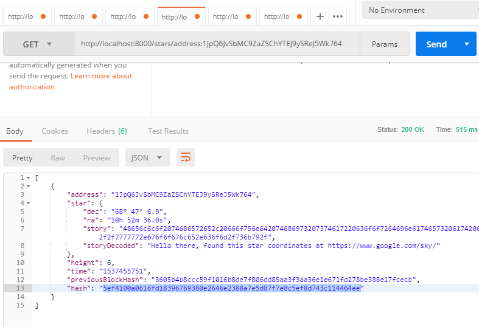

# Blockchain Data

Blockchain has the potential to change the way that the world approaches data. Develop Blockchain skills by understanding the data model behind Blockchain by developing your own simplified private blockchain.

## Getting Started

These instructions will get you a copy of the project up and running on your local machine for development and testing purposes.

### Prerequisites

Installing Node and NPM is pretty straightforward using the installer package available from the (Node.js® web site)[https://nodejs.org/en/].

In this project, I have made use of  [Hapi](https://hapijs.com/) nodejs framework. 

The port configuration is done in `index.js` file as required. 

### Configuring your project

- Use NPM to install all packages and dependencies in the package.json file to get you up and running. The following command will do in a command prompt:
```
npm install
```
- Next, you will need to run npm start to start the server as shown below
```
node app.js
```

## Testing
- To test the API, we are going to use [CURL](https://curl.haxx.se/) which is a command-line tool used to deliver requests supporting a variety of protocols like HTTP, HTTPS, FTP, FTPS, SFTP, and many more. So, to proceed, you should open another command prompt and type the following to test:

##Step 1: Configure Blockchain ID validation routine

***Requirement 3: Validate User Request***

```
curl -X "POST" "http://localhost:8000/requestValidation" \
     -H 'Content-Type: application/json; charset=utf-8' \
     -d $'{
  "address": "142BDCeSGbXjWKaAnYXbMpZ6sbrSAo3DpZ"
}'
```

**Requirement 4: Allow User Message Signature**

```
curl -X "POST" "http://localhost:8000/message-signature/validate" \
     -H 'Content-Type: application/json; charset=utf-8' \
     -d $'{
  "address": "142BDCeSGbXjWKaAnYXbMpZ6sbrSAo3DpZ",
  "signature": "H6ZrGrF0Y4rMGBMRT2+hHWGbThTIyhBS0dNKQRov9Yg6GgXcHxtO9GJN4nwD2yNXpnXHTWU9i+qdw5vpsooryLU="
}'
```

## Step 2: Configure Star Registration Endpoint

```
curl -X "POST" "http://localhost:8000/block" \
     -H 'Content-Type: application/json; charset=utf-8' \
     -d $'{
  "address": "142BDCeSGbXjWKaAnYXbMpZ6sbrSAo3DpZ",
  "star": {
    "dec": "-26° 29'\'' 24.9",
    "ra": "16h 29m 1.0s",
    "story": "Found star using https://www.google.com/sky/"
  }
}'
```

## Step 3: Configure Star Lookup*

***Requirement 1: Blockchain Wallet Address***

```
curl "http://localhost:8000/stars/address:142BDCeSGbXjWKaAnYXbMpZ6sbrSAo3DpZ"
```
***Requirement 2: Star Block Hash***

```
curl "http://localhost:8000/stars/hash:a59e9e399bc17c2db32a7a87379a8012f2c8e08dd661d7c0a6a4845d4f3ffb9f"
```


***Requirement 3: Star Block Height***

```
curl "http://localhost:8000/block/1"
```





**Credits**
I got inspiration from the following sites
- https://futurestud.io/tutorials/hapi-how-to-set-response-status-code
- https://www.joyent.com/node-js/production/design/errors
- https://github.com/llSourcell/Learn_Blockchain_in_2_months
- https://github.com/jungleBadger/udacity_blockchain
- https://stackoverflow.com/questions/37044289/typeerror-cannot-read-property-address-of-undefined-supertest
- https://github.com/ibrunotome/udacity-blockchain-developer-nanodegree
- https://www.thepolyglotdeveloper.com/2017/10/building-restful-api-nodejs-hapi-framework/
- https://developer.mozilla.org/fr/docs/Web/JavaScript/Reference/Erreurs/Not_a_function
- https://dev.to/genta/theres-no-else-if-in-js--24f9